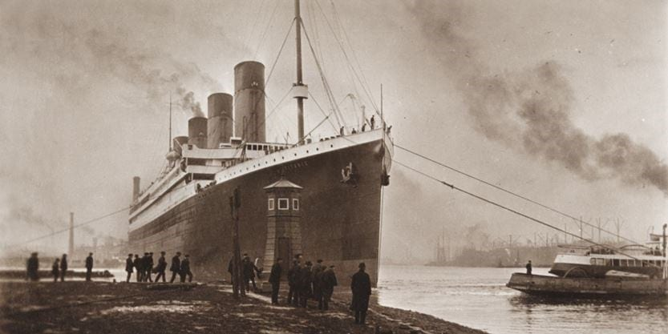

```{r setup, include=FALSE}
knitr::opts_chunk$set(echo = FALSE)
```

## Overview
The sinking of the Titanic was a colossal event in history that most of us and our ancestors (maybe fortunately) did not have the chance to experience. But what if you did? Would you have survived to tell the tale?  
  
Through this app, you can buy a ticket for the Titanic's voyage, entering some personal (real or fake) and trip-related info. Upon inputting your data, the app will predict whether or not you would've survived this catastrophe for the ages. 

<center>
 <br>
<small>Untergang der Titanic, by Willy Stöwer</small>
</center>

## Methods
1. Using the Titanic training data set from Kaggle, we first created a predictive random forest model (with KNN imputation pre-processing) to generate predictions of survivorship. This was done in scripts outside the app. 
2. Both the KNN pre-processing object and random forest model are then saved, and subsequently loaded into the app for prediction. 
3. As inputs are entered in the sidebar of the app, the app predicts whether or not a person with the inputted data would have survived using the loaded random forest model, and this prediction is outputted to the end user.
4. Plots of the training data (survivorship vs. input variables) are shown to the end user as well, with inputted categories highlighted in each plot to show where the inputted data stands in the training data.

## Results
The code below shows the loading and operation of the KNN algorithm and random forest model.

## Why Use It?
1. Travel back to the past and visualize how you'd fit into the Titanic data set.
2. Investigate the effects of different inputs on whether or not you'd survive.
3. Just for fun!

<center>


</center>